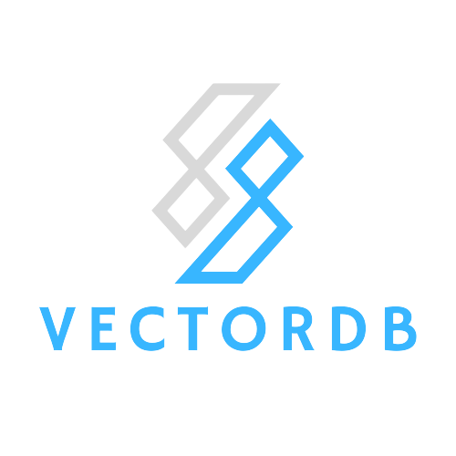

# VectorDB

Done:
- implement cosine similarity
- implement semantic search algorithm
- create a fancy logo
- store data function:
    - insert
    - read
    - erase
    - get all
    - semantic search

- CMakeList
- create how to access the db from outside system
- authentication

To-do:
- fix connection bug
- create Dockerfile
- create documentation and how to use
